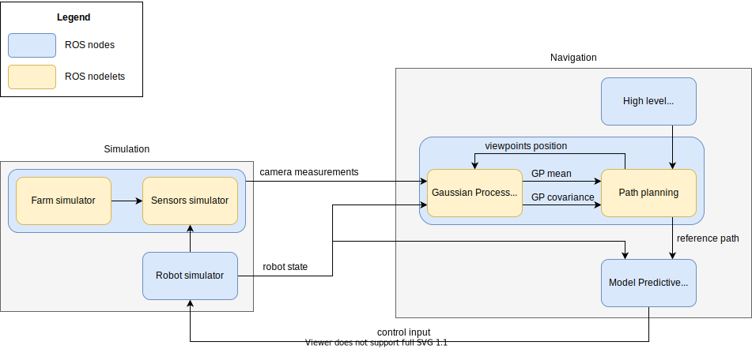

MFCPP documentation
===================


## Contents

- [Overview](##Overview)
- [Getting started](#Getting-started)
- [Main launchfile](#Main-launchfile)
- [Configuration files](#Configuration-files)
- [License](#License)
- [Read more](#Read-more)


## Overview
<a name="Overview"></a>

This projects tackles informative path planning for an underwater robot surveying an algae farm. It proposes a simulation of the algae farm, the robot and its sensors, along with a navigation pipeline collecting information about the farm, generating trajectories to collect as much information as possible and controlling the robot to follow it. The entire architecture of the software can be found in the following figure:



It is composed of several modules, split into a simulation and a navigation pipeline. The farm simulator generates algae lines and populates it with algae. Each algae has an interest heatmap which encodes zones of interest that need to be surveyed. The robot is simulated by integrating its dynamic equations at a regular pace, and its camera by casting rays and checking for collisions with a collision engine. A Gaussian Process updated by Kalman Filter gathers information about the farm. Using this, a path planner samples viewpoints along the algae wall and selects the ones that maximises information gain. Finally, a Model Predictive Controller generates control input to send to the robot so that it follows the desired reference trajectory while taking dynamic constraints into account. A high level planning module handles switching between algae lines or between wall sides for example.

The API documentation for the nodes and nodelets composing each modules can be found here:

Module | Class name
------ | ----------
Farm simulator              | `mfcpp::FarmNodelet`
Robot simulator             | `mfcpp::RobotSimulator` and `mfcpp::RobotModel`
Sensors simulator           | `mfcpp::CameraNodelet`
Gaussian Process mapping    | `mfcpp::GPNodelet`  
Path planning               | `mfcpp::PlanningNodelet`
High level planning         | `mfcpp::PlanningLogic`
Model Predictive Control    | `mfcpp::MPCNode`  


## Getting started
<a name="Getting-started"></a>

This software requires <a href="https://www.ros.org/">ROS</a>. It has been tested on Ubuntu 16.04 with ROS Kinetic. To install and start using it, simply follow these steps:
```
mkdir -p ros_ws/src
cd ros_ws/src
git clone https://github.com/CorentinChauvin/marine-farm-cpp.git
catkin build
source ../devel/setup.bash

roslaunch mf_experiments one_wall.launch
```

To generate Doxygen documentation, issue:
```
cd ros_ws/src/marine-farm-cpp/docs
doxygen
```


## Main launchfile
<a name="Main-launchfile"></a>

`mf_experiments/launch/one_wall.launch` is the main launchfile to start a simulated experiment where the robot surveys one algae wall. It has allows to select options in the introduction of the file. The different options are the following:

Parameter name | Meaning
-------------- | -------
`rviz`                      | Whether to run Rviz visualisation
`display_img_gp`            | Whether to visualise the map estimated by Gaussian Process
`display_cov_gp`            | Whether to visualise the Gaussian Process covariance
`display_diff_gp`           | Whether to visualise the difference between Gaussian Process map and ground truth
`path_planning`             | Whether to start the path planner
`back_forth_traj`           | Whether to publish a predefined back and forth path
`planner_initially_disabled`| Whether the planner is disabled when surveying the first side of the wall. If so, the robot will follow the back and forth trajectory if `back_forth_traj` is set to `true`
`mpc_control`               | Whether to start the Model Predictive Controller
`cart_control`              | Whether to start a cartesian controller. If so, the robot will follow the reference trajectory without taking care of any dynamic constraint.
`accelerate_time`           | Whether to change the time factor of the simulation, to accelerate the process
`experiment_stats`          | Whether to start the process recording statistics about the experiment
`save_gp_mean`              | Whether to save the mean of the Gaussian Process in a file at the end of the experiment
`load_gp_mean`              | Whether to load the mean of the Gaussian Process from a file at the beginning of the experiment


## Configuration files
<a name="Configuration-files"></a>

The different modules of the pipeline can be configured through several configuration files:

File name | Configuration
--------- | -------------
`mf_farm_simulator/config/farm_simulator.yaml`        | Farm generation
`mf_robot_simulator/config/robot_simulator.yaml`      | Robot model and simulation
`mf_sensors_simulator/config/sensors_simulator.yaml`  | Camera simulation
`mf_mapping/config/mapping.yaml`                      | Gaussian Process mapping
`mf_navigation/config/navigation.yaml`                | Path planning and control
`mf_experiments/config/one_wall.yaml`                 | Details about the algae wall surveying experiment, and overwrite some specific parameters defined previously


## License
<a name="License"></a>
The main part of the software is released under the open source license <a href="https://github.com/CorentinChauvin/marine-farm-cpp/blob/master/LICENSE">GNU LGPL-3.0</a>. It makes use of few dependencies released under different licenses:
- <a href="https://github.com/DanielChappuis/reactphysics3d">reactphysics3d</a> released under <a href="https://github.com/DanielChappuis/reactphysics3d/blob/master/LICENSE">Zlib</a> license.
- <a href="https://github.com/oxfordcontrol/osqp">OSQP</a> released under <a href="https://github.com/oxfordcontrol/osqp/blob/master/LICENSE">Apache 2.0</a> license.
- One modified file from <a href="https://github.com/robotology/osqp-eigen">osqp-eigen</a> released under <a href="https://github.com/robotology/osqp-eigen/blob/master/LICENSE">GNU LGPL-3.0</a> license.


## Read more
<a name="Read-more"></a>

More information about the method and the software can be found in the related Master's Thesis published <a href="http://kth.diva-portal.org/smash/record.jsf?pid=diva2%3A1438452&dswid=8330">here</a>.

Citing:
```
@mastersthesis{mastersthesis,
  author = {Corentin Chauvin-Hameau},
  title  = {Informative path planning for algae farm surveying},
  school = {KTH, School of Electrical Engineering and Computer Science (EECS)},
  year   = 2020
}
```
